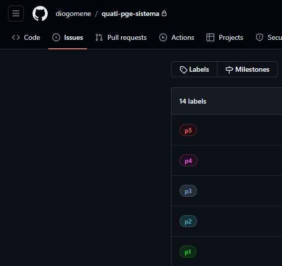

# Modelo de prioridade

Esse documento busca descrever, brevemente, o modelo de severidade escolhido.

Foi decidido por determinar a prioridade das funcionalidades a serem realizadas por meio de um modelo escalar, que varia de 1 até 5; sendo a prioridade 1 a menor, e a prioridade 5 a maior, e a prioridade 3 a prioridade média.

Ao adicionar uma issue no repositório, deverá ser indicada sua prioridade. As issues de maior prioridade deverão ser realizadas com maior antecedência.

Normalmente seria esperado que o modelo incluísse definições de severidade. A severidade é um bom indicador para que a equipe de desenvolvimento se organize para garantir que as funcionalidades mais severas sejam realizadas seguindo padrões estritos, ou que profissionais mais sêniores acompanhem de perto a realização dessas partes. Uma vez que o projeto está sendo realizado por apenas uma pessoa, e os padrões de rigorosidade de aplicação de padronizações não variará de função para função, devido ao tempo escasso, não foi percebido nenhum motivo relevante para sua inclusão nessa definição.

## TL;DR

O modelo de prioridade vai de 1 (menor) a 5 (maior). As issues no repositório devem indicar sua prioridade, e as de maior prioridade serão tratadas primeiro. A severidade não foi incluída, pois o projeto é realizado por uma única pessoa e os padrões de rigor serão os mesmos para todas as funcionalidades.